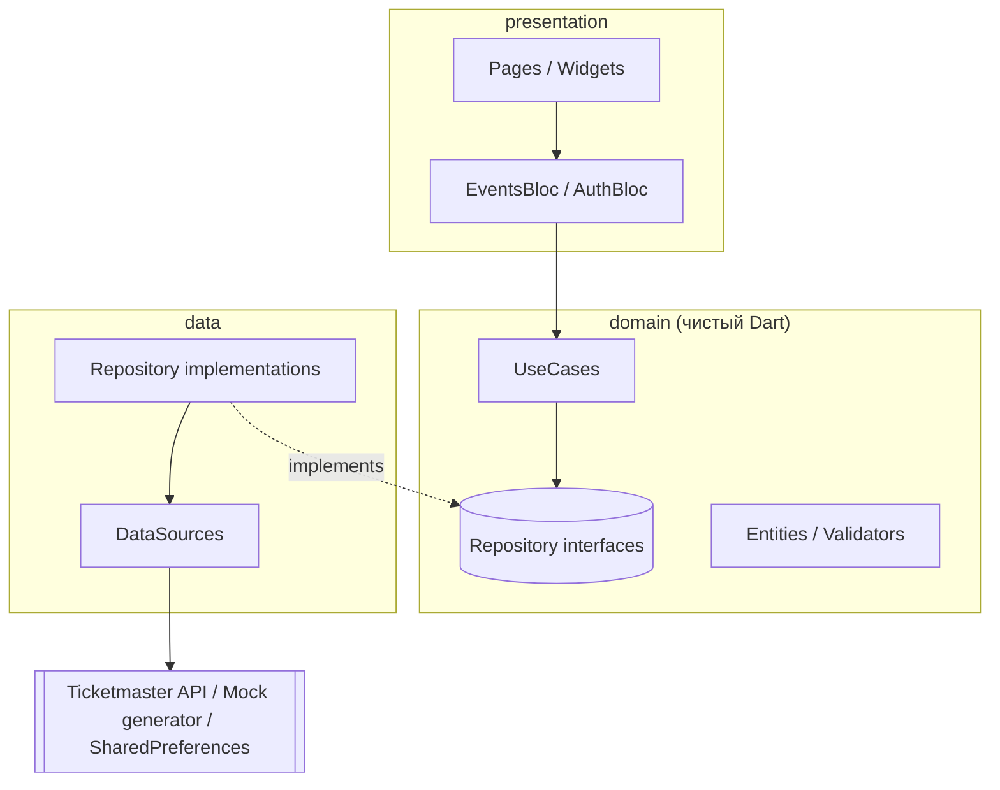

# EventSpot

Приложение для поиска мероприятий на интерактивной карте с кластеризацией меток.

- Карта на **OpenStreetMap** (`flutter_map`) — бесплатно, без ключей и без привязки карты.
- События: **демо-данные** из коробки (работают без ключей) или реальные события
  [Ticketmaster Discovery API](https://developer.ticketmaster.com/) с бесплатным ключом.
- Вход и регистрация (локально, на устройстве).

> 


## Возможности

- Карта с кластеризацией: близкие события группируются в кружок с числом,
  тап по кластеру приближает карту.
- Маркеры с иконкой и цветом категории (концерты, спорт, театр, кино, другое).
- Выезжающий список событий поверх карты, тап по карточке центрирует карту на событии.
- Превью события (bottom sheet) с фото, датой, местом и ссылкой на билеты.
- Фильтр по категории, кнопка «Искать в этой области», кнопки `+` / `−` и «Моё местоположение».
- Геопозиция с запасным городом, если доступ запрещён.
- Регистрация, вход, выход, сохранение сессии между запусками.
- Светлая и тёмная темы (Material 3).

## Быстрый старт

Требования: Flutter 3.19+ (Dart 3.3+).

```bash
# 1. Нативные проекты Android/iOS (их нет в репозитории, они генерируются локально)
flutter create --org com.eventspot --platforms=android,ios .

# 2. Зависимости
flutter pub get

# 3. Запуск с демо-данными (ключи не нужны)
flutter run

# ...или с реальными событиями Ticketmaster
flutter run --dart-define=TICKETMASTER_API_KEY=твой_ключ
```

Ключ Ticketmaster бесплатный: https://developer.ticketmaster.com/ → создать приложение →
скопировать `Consumer Key`. Принудительно включить демо-данные при наличии ключа:
`--dart-define=USE_MOCK_DATA=true`.

### Настройка Android

В `android/app/src/main/AndroidManifest.xml`, внутри `<manifest>` и выше `<application>`:

```xml
<uses-permission android:name="android.permission.INTERNET"/>
<uses-permission android:name="android.permission.ACCESS_FINE_LOCATION"/>
<uses-permission android:name="android.permission.ACCESS_COARSE_LOCATION"/>
```

Убедись, что `applicationId` в `android/app/build.gradle` равен `com.eventspot.eventspot`.
Это значение передаётся как `userAgentPackageName` в `TileLayer`: OpenStreetMap блокирует
запросы без собственного идентификатора приложения.

### Настройка iOS

В `ios/Runner/Info.plist`:

```xml
<key>NSLocationWhenInUseUsageDescription</key>
<string>EventSpot использует геопозицию, чтобы показать события рядом с вами</string>
```

### Эмулятор

Android-эмулятор по умолчанию считает, что вы в Калифорнии. Чтобы задать точку:
`...` в панели эмулятора → **Location** → **Set Location**.

### Тесты

```bash
flutter test --coverage
```

## Архитектура

Feature-First Clean Architecture, три слоя на фичу.



Правило зависимостей: **presentation → domain ← data**. `domain/` не импортирует
ничего из `data/` и Flutter, поэтому источник данных можно заменить, не трогая
BLoC и экраны. Именно так сделано с событиями: `EventsRemoteDataSource` имеет
две реализации (Ticketmaster и генератор демо-данных), а выбор происходит в одном
месте — `core/di/service_locator.dart`.

```
lib/
├── app/                  # MaterialApp, тема, go_router
├── core/                 # конфиг, DI, ошибки, сеть, базовый UseCase
└── features/
    ├── events/           # карта, кластеры, список, фильтры
    │   ├── domain/       # EventEntity, EventFilters, GetEvents
    │   ├── data/         # EventModel, Ticketmaster + Mock data sources
    │   └── presentation/ # EventsBloc, EventsMapPage, маркеры, карточки
    └── auth/             # вход и регистрация
        ├── domain/       # UserEntity, валидаторы, use cases
        ├── data/         # локальное хранилище на SharedPreferences
        └── presentation/ # AuthBloc, LoginPage, RegisterPage, ProfileButton
```

## Архитектурные решения (мини-ADR)

**1. `flutter_map` + OpenStreetMap вместо Google Maps.** Не нужны API-ключ и платёжная
карта, проект запускается у любого рецензента одной командой. Условия: обязательная
атрибуция (`© OpenStreetMap contributors`, есть на карте) и собственный
`userAgentPackageName`. Публичный тайл-сервер OSM не предназначен для высокой нагрузки:
для продакшена нужен отдельный тайл-провайдер.

**2. Собственный алгоритм кластеризации.** `ClusteringService` — около 20 строк чистого
Dart (группировка по сетке, размер ячейки зависит от зума), без сторонних плагинов и
без зависимости от виджета карты, поэтому полностью покрыт юнит-тестами. Компромисс: это
O(n), достаточно для сотен маркеров. Для десятков тысяч нужен quad-tree.

**3. Демо-генератор событий.** `MockEventsRemoteDataSource` порождает события
детерминированно: мир разбит на ячейки ~20 км, seed зависит только от координат ячейки,
поэтому при сдвиге карты события не «прыгают». Есть «горячие точки» для естественных
кластеров, работают фильтры, радиус и пагинация.

**4. Ручной JSON-парсинг вместо `json_serializable`.** Ответ Ticketmaster глубоко вложен
и непоследователен (координаты строками, две формы даты), поэтому явные фолбэки читаются
и тестируются проще, чем аннотации.

**5. Ручной `get_it` вместо `injectable`.** Без кодогенерации; регистрация — один файл.
При росте числа фич стоит перейти на `injectable`.

**6. `Either<Failure, T>` (fpdart).** Ни use case, ни репозиторий не бросают исключения
наружу; `try/catch` живёт только в репозиториях.

**7. Локальная авторизация.** Аккаунты хранятся в `SharedPreferences`, пароль — как
SHA-256 с солью. **Это демо:** данные живут только на устройстве, настоящей защитой это
не является. В реальном продукте пароли хешируются на сервере (bcrypt/argon2).
Так как логика опирается на интерфейс `AuthRepository`, локальную реализацию можно
заменить на PocketBase или Supabase, не меняя BLoC и экраны.

## Roadmap

| # | Фича | Что добавится |
|---|---|---|
| 1 | Избранное | Сердечко на карточке, список сохранённых событий, привязка к пользователю |
| 2 | Офлайн-режим | Кеш избранного (Isar/Hive), работа без сети |
| 3 | Бесконечный список | Пагинация поверх того же `EventsBloc` |
| 4 | Реальный backend | PocketBase/Supabase вместо локальной авторизации |
| 5 | Даты в фильтрах | «Сегодня», «Завтра», «Выходные» |

## Известные ограничения

- Покупка билетов не реализована сознательно: у публичного Ticketmaster API нет оплаты,
  кнопка ведёт на сайт Ticketmaster. У демо-событий ссылки на билеты нет.
- Локальная авторизация не защищает данные (см. ADR 7).
- Фото демо-событий случайные (picsum.photos) и не соответствуют категории.
- Кластеризация — сеточная, не quad-tree.
